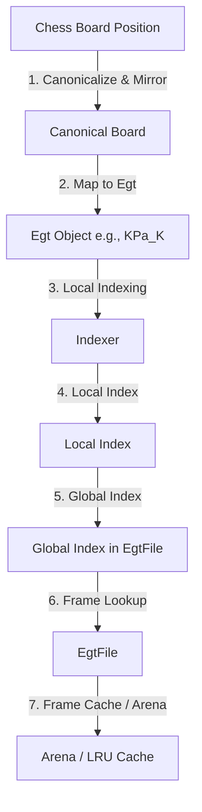

# Chess Endgame Tablebase (EGT) Design Specification

This document serves as the architectural specification and blueprint for the Chess Endgame Tablebase (EGT) project. It defines the data structures, indexing mechanisms, memory management, compression algorithms, and file formats used to generate and probe tablebases.

---

## 1. High-Level Architecture

The EGT system is divided into three logical layers:
1. **Storage & Memory Layer (`EgtFile` & `Arena`)**: Manages the physical files on disk, seekable Zstd compression/decompression, and the in-memory frame cache.
2. **Logical Indexing Layer (`Egt` & `Indexer`)**: Maps canonical chess board positions to a contiguous index space `[0, index_range)`.
3. **Outcome Representation Layer (`DtcOutcome`)**: Encodes the game outcome (Win/Loss/Draw), distance-to-conversion (DTC), and conversion type (Checkmate, Promotion, or Capture) into a compact 16-bit value.



---

## 2. Outcome Representation (`DtcOutcome`)

Each position's outcome is represented by a 16-bit `DtcOutcome` value.

The 16 bits of a `DtcOutcome` are structured as follows:
- **Bits 0-2 (WDL and Conversion Type)**:
  - `0b000`: Invalid / Unknown (used for unallocated/uncalculated positions)
  - `0b001`: Draw
  - `0b010`: Win by Checkmate
  - `0b100`: Win by Promotion
  - `0b110`: Win by Capture
  - `0b011`: Loss by Checkmate
  - `0b101`: Loss by Promotion
  - `0b111`: Loss by Capture
- **Bits 3-15 (Distance to Conversion)**:
  - A 13-bit unsigned integer representing the number of moves to conversion. This allows encoding distances up to $2^{13} - 1 = 8191$ moves.

---

## 3. Indexing & Symmetries

### 3.1 `Egt` and `Indexer`
An `Egt` represents a tablebase where the pawns are fixed on specific files (e.g., `KPa_K` or `KPa_KPc`).
- The `Indexer` handles the mapping of positions to a contiguous local index range `[0, index_range)`.
- En-passant positions are encoded separately in different ranges of indices (sub-tables) managed internally by the `Indexer`. The `Indexer` exposes a single unified index range for the entire `Egt`.

#### Local Indexing Algorithm (`board_to_index`)
The `Indexer` maps a chess position to a unique integer in `[0, index_range)` using a multi-step compaction and combinatorial encoding process:

1. **En-Passant Sub-Table Selection**:
   - The indexer checks if there is an active en-passant option on the board.
   - If so, it selects the corresponding sub-table and adjusts the `index_offset`. In this sub-table, the pawn on the 5th rank that can be captured en-passant is fixed and not encoded, reducing the number of combinations.

2. **Coordinate Extraction & Sorting**:
   - The board position is converted into coordinates `(rank, file)` for each piece.
   - To avoid duplicate indexing of identical positions for indistinguishable pieces (e.g., two white knights, or multiple pawns of the same color on the same file), their coordinates are sorted in a descending standard order.

3. **Symmetry Reduction (Pawnless Endgames)**:
   - If there are no pawns, the first king's position is restricted to 10 canonical squares (representing one octant of the board) using horizontal, vertical, and diagonal reflections. All other pieces are reflected accordingly to preserve relative positions.

4. **Square Indexing**:
   - Each coordinate is converted to a raw square index in `0..64` ($rank \times 8 + file$).

5. **Index Compacting (`compact_pidx`)**:
   - Since no two pieces can occupy the same square, the raw square indices are compacted to remove "holes" caused by already occupied squares.
   - For each piece $i$, its index is adjusted by subtracting the number of preceding pieces $j < i$ that occupy a lower square index ($s_j < s_i$). This maps the indices sequentially to ranges `[0..64, 0..63, 0..62, 0..61, ...]`.

6. **Pawn-Specific Compacting**:
   - Pawns are restricted to ranks 2-7 (6 possible squares on their designated file). Their positions are converted to compact indices in `0..6` ($rank - 1$).
   - If multiple pawns of the same color are on the same file, their indices are compacted relative to each other (mapping them to `[0..6, 0..5, ...]`).

7. **King-Specific Mapping (Pawnless Endgames)**:
   - For pawnless endgames, the positions of the two kings are mapped together. Since they cannot stand on adjacent or identical squares, a precomputed lookup table (`kings_map_to_index`) maps the valid joint positions of both kings to a single index in `0..462`.

8. **Combinatorial Encoding (`cpidx_to_index`)**:
   - The compacted indices of each piece group are aggregated into a single integer using a mixed-radix system.
   - For a group of $k$ identical pieces of a type that can occupy $n$ available squares, the number of combinations is given by the binomial coefficient $\binom{n}{k}$ (using a precomputed `N_CHOOSE_K` table).
   - The combination index for these $k$ pieces with compacted indices $c_0 > c_1 > \dots > c_{k-1}$ is computed using the combinatorial number system (combinadics):
     $$\text{group\_index} = \sum_{j=0}^{k-1} \binom{c_j}{k-j}$$
     *(Note: for $k=1$, it is simply $c_0$).*
   - These group indices are then combined using a mixed-radix base where the multiplier for each group is the total number of combinations of the subsequent groups.
   - The final index is:
     $$\text{local\_index} = \text{index\_offset} + \text{aggregated\_combinations}$$

### 3.2 `EgtFile` Composition
An `EgtFile` represents a physical file on disk (e.g., `KP_K`) and is composed of multiple `Egt` objects (e.g., `KPa_K`, `KPb_K`, `KPc_K`, `KPd_K`).
- The `EgtFile` maps its global index space sequentially to the constituent `Egt` objects.
- The global index is computed as:
  $$\text{global\_index} = \text{egt\_offset} + \text{local\_index}$$
  where $\text{egt\_offset}$ is the sum of the index ranges of all preceding `Egt` objects in a stable, deterministic order (e.g., sorted alphabetically by name).

---

## 4. File Format & Compression

On disk, an `EgtFile` is compressed using a seekable Zstd format (via the `zeekstd` library).

### 4.1 Frame-Based Organization
- The file is divided into **frames**, each containing a fixed number of positions (e.g., $N = 16384$).
- A frame size of $N = 16384$ positions (32KB uncompressed) is recommended to balance Zstd compression efficiency with random-access lookup latency.
- Each frame is compressed independently, allowing seekable random access.

### 4.2 Bit-Slicing (Transposition) Algorithm
Before applying Zstd compression to a frame of $N$ positions, the 16-bit `DtcOutcome` values are transposed (bit-sliced) to maximize compressibility:

1. **Slice 0 (1 bit/pos)**: Bit 0 of all $N$ outcomes ($N/8$ bytes).
2. **Slice 1 (1 bit/pos)**: Bit 1 of all $N$ outcomes ($N/8$ bytes).
3. **Slice 2 (1 bit/pos)**: Bit 2 of all $N$ outcomes ($N/8$ bytes).
   *(Slices 0-2 encode the WDL outcome and conversion type).*
4. **Slice 3 (4 bits/pos)**: Bits 3-6 of all $N$ outcomes ($N/2$ bytes).
5. **Slice 4 (4 bits/pos)**: Bits 7-10 of all $N$ outcomes ($N/2$ bytes).
6. **Slice 5 (5 bits/pos)**: Bits 11-15 of all $N$ outcomes ($5N/8$ bytes).
   *(Slices 3-5 encode the distance to conversion. Slice 5 is almost always all zeros).*

The scrambled sequence of bits is concatenated and compressed using Zstd. Decompression reverses this process.

---

## 5. Memory Management & Arena

An `Arena` manages a fixed pool of memory (e.g., 16GB) allocated at startup.

### 5.1 Frame States
Each frame in an `EgtFile` can be in one of three states:
1. **Unallocated**: The frame is not loaded or has not been calculated yet (all outcomes default to invalid/unknown).
2. **Compressed**: Only the compressed representation of the frame is stored in memory.
3. **Uncompressed**: The frame is fully uncompressed in memory as a contiguous array of `u16` values.

```rust
pub enum FrameState {
    Unallocated,
    Compressed(Vec<u8>),
    Uncompressed {
        compressed: Option<Vec<u8>>, // Cached compressed bytes to avoid re-compression
        uncompressed: Vec<u16>,      // Uncompressed DtcOutcome values
        dirty: bool,                 // True if modified since loading/creation
    },
}
```

### 5.2 LRU Cache & Eviction
- When a frame needs to be written to or read, its uncompressed buffer is allocated from the `Arena`.
- If the `Arena` runs out of memory, the Least Recently Used (LRU) uncompressed frames are evicted:
  - **If `dirty == true`**: The frame is bit-sliced, compressed using Zstd, and its state transitions to `Compressed`. The uncompressed memory is returned to the `Arena`.
  - **If `dirty == false`**: The uncompressed memory is immediately freed and returned to the `Arena` without re-compression (using the cached `compressed` bytes).
- **Concurrency**: To support high-performance parallel retrograde analysis, the `Arena` and LRU cache should use sharded locking or lock-free structures to prevent thread contention.

---

## 6. Retrograde Analysis & Probing

### 6.1 Tablebase Generation (Retrograde Analysis)
- **Initialization**: Start with an `EgtFile` where all frames are `Unallocated`.
- **Iterative Backwards Search**:
  - Identify terminal positions (checkmate, stalemate, captures/promotions that lead to already-solved tablebases).
  - Backpropagate outcomes to predecessor positions.
  - When writing outcomes, allocate uncompressed frames from the `Arena` as needed.
  - Periodically flush dirty frames to disk using seekable Zstd.

### 6.2 Fast Lookup (Probing)
- **Initialization**: Initialize `EgtFile` with all frames in the `Compressed` state (loaded from the seekable index on disk) or `Unallocated` (if they don't exist).
- **On-Demand Decompression**:
  - When a position is probed, determine its global index and identify the corresponding frame.
  - If the frame is `Compressed`, decompress only that frame, transition its state to `Uncompressed` (with `dirty = false`), and query the outcome.
  - If the frame is already `Uncompressed`, query it directly (updating its LRU status).
