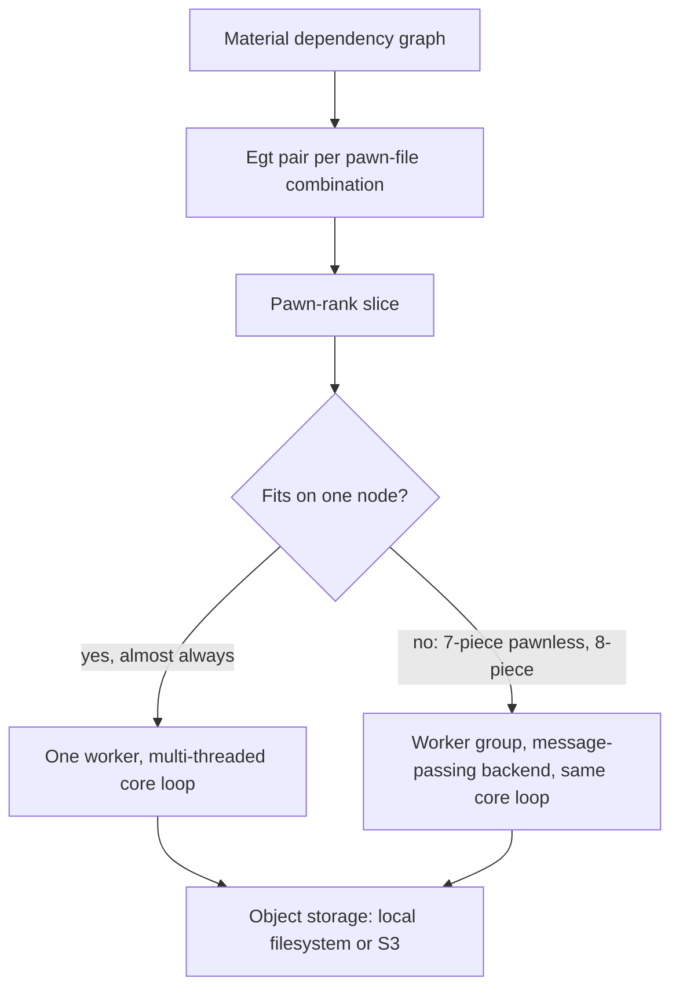
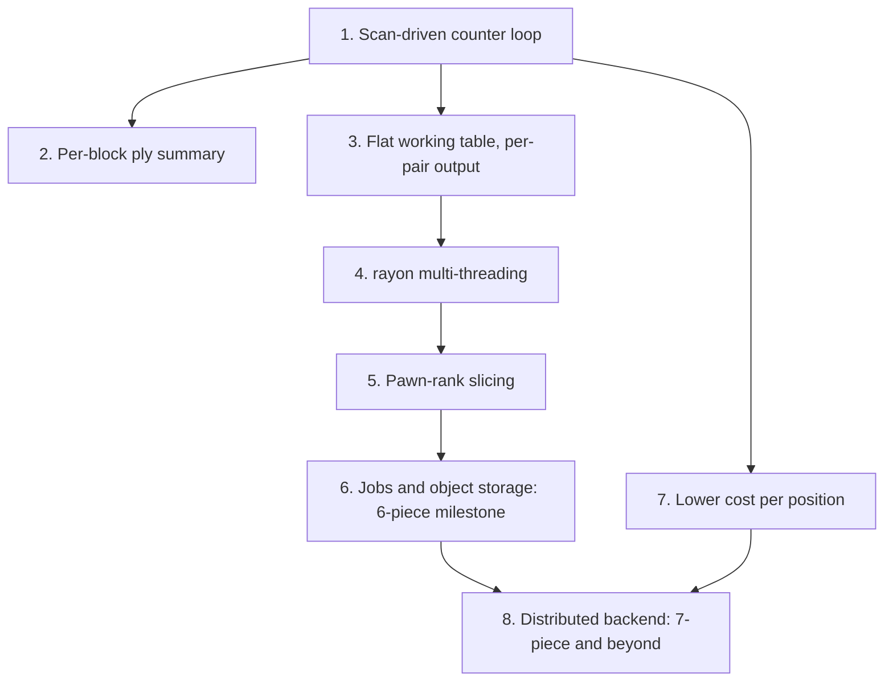

# Scaling and Parallelization: Design and Roadmap

This document reviews the key design choices of `chess-egt` in view of generating
6-piece tablebases and beyond. It compares two ways to parallelize:
shared-memory multi-threading and a swarm of message-passing workers with
separate memory. It ends with a proposed implementation roadmap.

It builds on [`algorithms_comparison.md`](algorithms_comparison.md), in
particular the single-threaded measurements of the counters and sweep core
loops in its Section 2.A.

**Status:** Steps 1-4 are implemented; later steps remain a roadmap. Historical
Step 1/2 validation and measurements are recorded below. Step 3 is reference-validated
on the sets listed below; its remaining sample measurements are still open.
Step 4 correctness checks and initial scaling measurements are recorded below. Sizes are computed from
the current indexing scheme. Compute estimates are extrapolated from the
measured 4- and 5-piece generation times in `AGENTS.md` and should be treated as orders of magnitude.

---

## 1. Summary

- **6-piece tables do not need distributed memory.** The largest 6-piece
  table pair (both sides-to-move of one `Egt` pair) takes ~25 GB at 2 bytes per
  position. The bottleneck is compute (~10⁴ core-hours at the current cost per
  position), not memory. Independent jobs, each multi-threaded on one machine,
  are enough.
- **7-piece tables need distributed memory only for a minority of cases.**
  Pawnless tables and one-pawn tables without rank slicing need ~1.2-1.4 TB
  per pair. Pawnful tables split into small independent slices. 8-piece
  tables need distributed memory everywhere.
- **The implemented core loop is a hybrid:** **decremental counters driven by per-ply table scans**
  (no queues). It has the counters' low work per retrograde edge and the
  sweep's zero extra memory. Its updates are pushed to the position being
  updated and never require reading remote data. It therefore runs unchanged on
  shared memory (atomic updates) and on separate-memory workers (messages).
- **Recommended order:** independent jobs first, multi-threading second,
  worker swarm last, built behind the same core-loop abstraction.
- **At 7 pieces, the cost per position dominates everything.** A 5x faster core
  loop saves more than any parallelization design.

---

## 2. Scale of the problem

### 2.1 Memory

Positions per side-to-move under the current indexing, for the worst case where
all non-king pieces are distinct. Memory is for one table pair (both sides) at
2 bytes per position:

| Pieces | Pawnless pair | 1-pawn `Egt` pair (fixed file) | Same, one pawn-rank slice |
|---|---|---|---|
| 5 | 0.42 GB | 0.34 GB | 57 MB |
| 6 | **24.7 GB** | 20.2 GB | 3.4 GB |
| 7 | **1.43 TB** | 1.17 TB | 195 GB |
| 8 | 82 TB | 67 TB | 11 TB |

How the numbers are computed:
- Pawnless: 462 king pairs times `62 * 61 * ...` for the other pieces.
- 1-pawn: 6 pawn squares times `63 * 62 * ...` for the other pieces.
- Rank slice: the 1-pawn value divided by the 6 pawn ranks.
- Tables with repeated pieces are smaller (divide by `k!`). Multi-pawn tables
  add small en passant sub-tables.

These values match the measurements. For example, the sweep's peak RSS of
~500 MiB on `KQB_KQ` is essentially the 0.42 GB of tables, while the counters'
queues peak at 3.5-8.4 GiB on shallow 5-piece tables.

A relevant detail: a 6-piece pawnless table has 6.2 × 10⁹ positions per side,
which is more than `u32::MAX`. Storing indices as `u32` (a TODO in `AGENTS.md`)
therefore only works for indices relative to a chunk, not for local `Egt`
indices.

### 2.2 Compute

- 5-piece generation took 26 h for 2.6 × 10¹⁰ positions, i.e. ~3.6 µs per
  position, single-threaded.
- From 4 to 5 pieces, the number of positions grew ~200x and the time ~480x:
  the cost per position also grows with the number of pieces (more moves, more
  unmoves, longer decode/encode).

Extrapolating with the same factors:

| Pieces | Positions (all tables, order of magnitude) | Core-hours (order of magnitude) |
|---|---|---|
| 6 | ~5 × 10¹² | ~10⁴ (about a week on one 64-core node) |
| 7 | ~10¹⁵ | ~10⁶-10⁷ |

The per-position cost at 7 pieces directly sets the cloud bill. The hotspots
listed in `AGENTS.md` (`Chess::from_setup`, `Indexer::position_to_index`) are
therefore strategic, not incidental (see Section 6.2).

---

## 3. Three levels of parallelism

The discussion is often framed as "shared-memory threads vs. worker swarm".
There are actually three levels, and the first one is the most important for a
cloud deployment.

### Level 1: independent jobs

The work already splits into independent units:

1. **Endgames** form a dependency graph (by number of pieces, then by material
   reached through captures and promotions).
2. **`Egt` pairs** within an endgame are independent: a pawn capture changes
   the material and therefore goes to a different endgame.
   `retrograde_analysis` already solves pairs one after the other with no shared
   state apart from the dependency cache.
3. **Pawn-rank slices** within a pair: pawn pushes cannot be undone, so pawn
   configurations form a dependency graph as well (the "topological slicing"
   of `chesstb`, `algorithms_comparison.md` Section 3.3).

Pawns are the most significant digits of the mixed-radix index, so **a
pawn-rank slice of an `Egt` is a contiguous index range**, apart from the en
passant sub-tables, which need an explicit mapping. Slicing therefore needs no
change to the file format.

When a slice is solved, successors in an already solved higher-rank slice
are treated like dependency tables: they are read, not written. Their outcomes
are injected into the retrograde loop at the matching ply. A pawn push to a
position lost at ply `d` makes its predecessor a win at ply `d + 1`, so that
predecessor has to be handled at ply `d + 1`, not during initialization.

The result is thousands of **idempotent, retryable jobs** that read inputs from
object storage and write outputs to it. This needs a scheduler, not MPI.

### Level 2: shared-memory multi-threading

Needed to use all cores of a node, and to solve the large pawnless pairs that
cannot be sliced. Straightforward with `rayon`, provided the core loop's updates
give the same result in any order (Section 4).

### Level 3: distributed memory across separate workers

Needed only when a single pair or slice does not fit on one node:

- 7-piece pawnless pairs (~1.4 TB);
- 7-piece pawnful pairs, if they are not sliced;
- essentially everything at 8 pieces.

Cloud instances with 2-4 TB of RAM exist, so even 7-piece pawnless tables do
not *strictly* require Level 3. Whether to use them or a group of smaller
instances is a cost and availability tradeoff.



---

## 4. The core loop, seen through parallelism

### 4.1 Re-examining the contention argument

`algorithms_comparison.md` argues for candidate flags partly because the
counters' updates need atomics, which may contend. For this project the argument
is weak:

- The workload is **compute-bound**: one unmove plus indexing costs hundreds of
  nanoseconds, while an uncontended atomic RMW costs a few tens.
- Tables are tens of GB and accessed at scattered locations, so two threads
  rarely write to the same cache line at the same time.
- The sweep also needs atomic writes: its propagation step marks predecessors
  in the twin table, which may belong to another thread's chunk.

The properties that do matter:

| Property | Counters + queues (current) | Sweep (current) | **Counters + table scan (proposed)** |
|---|---|---|---|
| Work per retrograde edge | 1 unmove + decrement | 1 unmove + mark, **plus** forward check of each candidate (decode + 3-5 moves) | 1 unmove + decrement |
| Extra memory | queues, several times the table size | none | none (optional small per-block summary) |
| Updates safe to apply twice | no | yes | no |
| Push-only (updates never read remote data) | yes | **no**: the forward check reads successors, possibly remote | yes |
| Order-independent output | yes (serial) | yes | yes, with conversion-type phases (4.3) |
| Symmetry handling | +2 counters, mirrored decrements (done and verified) | simpler | same as counters (reused) |

### 4.2 The proposed hybrid: counters driven by table scans

Each resolved position already stores its distance, so the set of positions
to propagate at ply `p` is exactly "values whose distance is `p`". The queues
only re-derive information already stored in the table.

Current order of operations in `solve_pair_counters`, at ply `p`:
1. Mark wins at `p` from losses found at `p - 1`.
2. Decrement counters from wins found at `p - 1`. A counter reaching zero gives
   a loss at `p`.

Scan-driven equivalent, per ply `p` (for both tables of the pair):

```text
phase W(p): for each position L in table X with value loss(ct, p-1):
                for each quiet unmove L -> P into twin(X):
                    if P is unknown: P := win(ct, p)          // CAS, idempotent

phase L(p): for ct in [Checkmate, Capture, Promotion]:        // sub-phases, in this order
                for each position W in table X with value win(ct, p-1):
                    for each quiet unmove W -> P into twin(X):
                        if P is unknown with counter c:        // CAS loop
                            P := (c == 1) ? loss(ct, p) : unknown(c - 1)
```

Why this gives exactly today's output:

- **No interference within a phase.** Phase W reads losses at `p - 1` and
  writes wins at `p`. Phase L reads wins at `p - 1` and writes losses at `p`.
  Values written in a phase are never scanned in the same phase.
- **Wins.** Phase W's "mark if unknown" gives the same result in any order,
  provided a win's conversion type is resolved by preference (Checkmate >
  Capture > Promotion), as `mark_win` in the sweep implementation does. The
  serial counter loop reaches the same result by processing the Checkmate queue
  first.
- **Losses.** The only order-dependent part of the counters is the conversion
  type of the decrement that brings a counter to zero. The serial loop
  processes the loss queues in Checkmate, Capture, Promotion order. The
  resulting type is therefore "the last category, in that order, with a
  successor at `p - 1`", i.e. the loss preference Promotion > Capture >
  Checkmate. Running the three categories as separate sub-phases reproduces
  this exactly, whatever the order within each sub-phase. An alternative is a
  short forward pass on each new loss to find its type. That pass only runs on
  actual losses, so it is much cheaper than the sweep's forward check on every
  candidate.
- **Initialization** can apply the conversion decrements directly to the
  position's own counter. A position only updates itself at that point, so
  there is no contention. Positions with a winning conversion are marked as
  win at ply 1 (the preference logic handles a later Checkmate at ply 1).
  Positions whose moves are all conversions to won dependency positions become
  losses at ply 1.
- **Diagonal symmetry** keeps the existing, verified scheme: `+2`
  initialization and mirrored decrements in `quiet_unmoves`.

Scan cost:
- Each phase is a vectorizable linear scan: ~1 s for a 25 GB 6-piece pair on a
  multi-core node, which is negligible.
- At 7 pieces (1.4 TB × up to ~1,000 plies) scans add up to hours. A per-block
  summary (one `u16` per block of 4K positions: "last ply at which this block
  received a resolved value") lets scans skip untouched blocks (implemented,
  see Step 2). It also fixes the case where the sweep does worst: deep tables
  where each ply resolves only a few positions (`KNN_KP`: +53% for the sweep).

What this means for the existing implementations:
- **Counters + queues** become redundant once the hybrid is verified. Its
  queue memory is the main obstacle for 6 pieces.
- **Sweep** stays as an **independent reference implementation**. The sha256
  cross-check between two independently designed loops is very valuable. Further
  optimization of the sweep is not a priority, because its forward check does
  not fit the push-only, separate-memory model (it reads successors that may
  belong to another worker).

### 4.3 The key invariant

> During a phase, the core loop only **pushes updates addressed to a position**
> (`mark-win(idx, ct, p)` or `decrement(idx, ct, p)`). It never reads the state
> of a position it does not own.

Everything else follows from this invariant. With threads, an update is an
atomic CAS on a shared array. With workers, an update is an entry in a batched
message to the position's owner. The retrograde logic (unmoves, symmetry, phase
order, conversion types) is written once, against an "update sink" abstraction.

---

## 5. The worker swarm in detail

### 5.1 Partitioning

The mixed-radix layout already has useful locality:

- **Pawnless:** the king pair is the most significant digit. A non-king move or
  unmove from king-pair block `k` in table A always lands in one block `σ(k)` of
  table B (kings swapped and canonicalized). Putting both blocks on the same
  owner keeps all non-king edges local.
- **Pawnful:** pawns come first, then kings, so the same holds within a pawn
  configuration.
- Only king moves (and pawn moves in pawnful tables) cross block boundaries.
  With 3-4 non-king pieces, an estimated (not measured) 15-30% of edges leave
  their block.

### 5.2 Communication volume

Worst case, every edge crosses the network:
- ~200 ns of compute per edge and 32 cores per node give ~160 M edges/s/node;
- at 4 bytes per chunk-relative index, that is ~0.65 GB/s/node, within a
  25 Gbps link. Delta-encoding sorted batches roughly halves it.

Because computing an edge is expensive, **communication is not the
bottleneck**. This leaves room to trade locality for load balance, e.g.
assigning blocks to owners by hash rather than by contiguous ranges.

### 5.3 Chunks vs. workers

A **chunk** (e.g. ≤ 4 GiB, so that `u32` chunk-relative indices suffice) is the
unit of addressing, ownership and checkpointing. A **worker** is one process per
node that owns many chunks and uses all its cores. It is not one process per
chunk. This gives:

- traffic between chunks on the same node never touches the network;
- load can be rebalanced by moving chunks between workers;
- the same worker binary serves Level 2 (one worker, all chunks) and Level 3
  (many workers).

### 5.4 Synchronization

All workers advance through the same phases in lockstep, with a barrier and an
exchange per phase: ~4 phases per ply (W plus three L sub-phases) × 2 tables ×
up to ~1,000 plies.
- At 10-50 ms per barrier on EC2, the synchronization cost itself is minutes.
- The real cost is **load imbalance**: a ply's resolved positions may be
  concentrated in a few king regions, leaving other workers idle. This also
  favors assigning blocks by hash.

### 5.5 Bounded memory

Send buffers must be bounded and streamed (flushed at a size threshold,
applied by the receiver on arrival). A single all-to-all exchange of all
updates per ply would bring back the queue-memory problem as network buffers.
This works with counters because the receiver applies each decrement
immediately and keeps nothing.

### 5.6 Failures

- Counter decrements are not idempotent and must be **applied exactly once**.
- Standard approach: checkpoint chunks every N plies (to local NVMe, then
  asynchronously to object storage). If a worker is lost, all workers roll back
  to the last checkpoint.
- Sequence-numbering batches per (phase, sender) also makes resending safe.
- Plain MPI fits poorly with spot instances: it has a fixed number of ranks and
  a lost rank aborts the job. The transport should therefore be a thin internal
  abstraction (MPI, or a simple TCP/QUIC mesh) rather than a direct dependency
  of the core loop.

### 5.7 When the swarm is worth it

Only for pairs that do not fit on one node: 7-piece pawnless (if very-large-RAM
instances are not used), unsliced 7-piece pawnful, and 8 pieces. Everywhere
else it adds complexity without reducing cost.

---

## 6. Other design choices to revisit

### 6.1 Separate the working table from `EgtFile` (implemented in Step 3)

`EgtFile`'s frame model (Unallocated / Compressed / Uncompressed, with LRU
eviction planned) suits **dependency tables and probing**, whose accesses are
sparse and repeated. Retrograde unmoves instead hit the whole working set at
scattered locations, making frame-cache lookup and eviction inappropriate for
**the tables being solved**.

The solver now uses flat `Vec<AtomicU16>` arrays for the active pair,
separate from `EgtFile`. Finalized tables are compressed into one spool per
output file, so solved pairs do not accumulate as uncompressed file frames.
Working memory is one pair plus the dependency cache, index metadata, local
summaries, statistics, and compression/I/O buffers. Recursive dependency
generation is an exception: a parent pair can remain allocated while a
dependency is solved.

Atomic working values for shared-memory parallelism are implemented in Step 4.
Memory-mapped arrays for out-of-core runs remain a future option.

### 6.2 A generation-specific index layout (larger lever, needs measurement)

The storage index (canonicalization, removing gaps for occupied squares,
combinatorial numbering) is compact but expensive to encode and decode. This
matches the profile, where `from_setup` and `position_to_index` are the top
hotspots. During generation, a less compact layout with 6 bits per square lets
most moves become simple arithmetic on the index, and lets a move be applied to
a position without re-validating it. Such a layout costs ~25% more memory for a
6-piece pawnless table; converting to the storage layout at write time is a
single linear pass. (Unverified: Syzygy's `tb` appears to use a layout of this
kind, which would explain the "6-piece in ~16 GB at 1 byte/pos" figure in
`algorithms_comparison.md`.)

Given the 10⁶-10⁷ core-hour estimate for 7 pieces, this may be the single most
valuable optimization, but it is a significant change and must be measured on
5-piece tables first. A smaller first step is the `AGENTS.md` TODO of avoiding
`from_setup` re-validation when decoding a known-valid index.

### 6.3 Value width

2 bytes per position (3-bit type + 13-bit distance or counter) is affordable up
to 7 pieces. A 1-byte encoding (distances stored modulo a window, with periodic
spills to disk, as Syzygy does for DTZ) halves memory but complicates the
counters. Defer to 8 pieces.

### 6.4 Reverse capture/promotion unmoves during initialization

Relevant mainly because they turn dependency reads into **sequential,
streamable passes** (good for object storage), instead of random probes that
need a frame cache. For 6 pieces, forward probing with a frame cache is good
enough. Worth revisiting together with the object-storage work.

---

## 7. Implementation roadmap

Each step is independently useful. Changes that preserve the storage layout
retain the **byte-identical** output guarantee (sha256 comparisons against the
appropriate reference baseline). Step 3 changes the frame layout and instead
requires per-index outcome/DTC equality and logical statistics equality,
excluding `bytes`, `sha256`, and `num_frames`. Historical Step 1/2 results below
remain unchanged; they do not establish Step 3 validation.

### Step 1: scan-driven counter loop (single-threaded)

- Implement Section 4.2 as a third `Algorithm` variant (e.g. `scan`), reusing
  `quiet_unmoves` and the symmetry-adjusted counter initialization.
- Conversion-type sub-phases, as in 4.2, so the output does not depend on
  processing order.
- Write the loop against an internal "update sink" interface
  (`mark_win(table, idx, ct, ply)`, `decrement(table, idx, ct, ply)`), with a
  direct, non-atomic implementation for now.
- **Acceptance:** byte-identical output. Time close to the counters
  (target ≤ +5%). Peak memory close to the sweep's. Measure on the 5-piece
  sample of `algorithms_comparison.md` Section 2.A.
- Then: make `scan` the default and decide whether to keep `counters` (the
  queues) or retire it. Keep `sweep` as the reference.
- **Status: done.** Implemented as `--algorithm scan`. Output is
  byte-identical (`.ggegt` and `.json`) on all 3/4-piece tables and the 5-piece
  sample. It is now the only core loop (`solve_pair` in `retrograde.rs`): the
  `counters` and `sweep` loops were removed to keep the code simple (they
  remain in the git history). The update sink is two methods on
  `RetrogradeSolver` (`mark_win`, `decrement`). The loop is not generic over it
  yet, because `quiet_unmoves` passes the whole solver to its callback; this
  split belongs to Steps 3-4.

### Step 2: per-block ply summary

- One byte per block recording the last ply at which a value was resolved in
  it. Scans skip blocks that cannot contain values of the scanned ply.
- **Acceptance:** check if there are meaningful advantages of this approach on
  deep tables where each ply resolves few positions (`KNN_KP`, `KBB_KN`). If
  yes we keep it, otherwise we go ahead without any changes.
- **Status: done, kept.** `PlySummary` in `retrograde.rs`: one `u16` per block
  of 4096 positions (aligned on global indices, so a block never crosses a
  frame), created per pair in `solve_pair`. Every block starts at ply 1, which
  covers initialization. A block is stamped when `mark_win` or `decrement`
  resolves a position in it. A scan for values at `p - 1` visits the blocks
  stamped at `p - 1` or later: this is conservative (blocks stamped at `p` are
  visited too), which keeps the output byte-identical. The list of blocks is
  taken before each scan, which is correct because a scan only writes values at
  `p`. Measurements (single-threaded, baseline and new binaries run
  concurrently on the same machine):

  | Set / Endgame | Blocks visited | Propagation before | After | Δ |
  |---|---:|---:|---:|---:|
  | `KNN_KP` (run 1 / run 2) | 20% | 247.0 s / 245.0 s | 227.1 s / 221.8 s | **-8% / -9%** |
  | `KBB_KN` | 65% | 132.2 s | 131.4 s | -1% |
  | All 4-piece | 54% | 248.0 s | 247.9 s | 0% |

  Output is byte-identical (`.ggegt` and `.json`) on all 4-piece tables,
  `KNN_KP` and `KBB_KN`. The gain matches the scan overhead measured in
  Step 1 on `KNN_KP` (+10%), which is now almost gone. `KBB_KN` gains little
  because the positions resolved at a ply are spread over most blocks. The
  summary pays off only when the frontier is thin in blocks, not just in
  positions. Separate win/loss summaries or smaller blocks might tighten
  this, but were not tried.

### Step 3: flat working table, per-pair output

- **Status: implemented and reference-validated on all 3/4-piece endgames,
  `KNN_KP`, and `KBB_KN`.**
  The active pair uses flat `Vec<MaybeDtcOutcome>` arrays separate from
  `EgtFile`. `quiet_unmoves` takes immutable source/twin `Egt` metadata and
  calls back with predecessor local indices, rather than passing the solver.
- `PlySummary` retains the Step 2 conservative scan logic, but its 4096-position
  blocks are now aligned on each table's local indices, independent of storage
  frames. The global alignment described in Step 2 is historical.
- Each finalized table is compressed into **one spool per output file** and its
  working array is released after staging the pair. Frames are table-aligned,
  contain at most `256 * 1024` positions, and end in short, unpadded tails.
  The transposition is unchanged: exactly `2 * N` bytes for a frame of `N`
  positions, including the unused zero tail after packed high bytes.
- Final assembly copies compressed segments in stable table order, without
  recompression, and writes **one final seek table**. The encoder is flushed
  before `into_seek_table`, which does not flush its output buffer. No
  `RawEncoder` is needed.
- The reader constructs the table-aligned frame layout from the `Egt` lengths
  and validates frame counts and decompressed lengths against the seek table.
- `retrograde_analysis` finishes and publishes the output files before
  returning. Each rename is atomic, but the two-file publication is
  **nontransactional**: a failure between renames can update only one file.
- Working memory is one pair plus dependency cache, index metadata, summaries,
  statistics, and compression/I/O buffers. Recursive dependency generation can
  retain a parent pair while solving a dependency (Section 6.1).
- **Acceptance:** per-index outcome/DTC equality and logical statistics
  equality, excluding `bytes`, `sha256`, and `num_frames`. Exact outcome values (including conversion type
  and DTC) and semantic statistics matched the reference tables in
  `~/tablebases` for every logical index in both orientations of the validated
  endgames.
- **Validation:** `cargo test --release` covers full/short frames, disk-backed
  resaving, reverse-order staging, invalid layouts, missing/duplicate
  submissions, and temporary-file cleanup. The reference comparisons above
  were performed during Step 3 implementation. The remaining four endgames
  in the 5-piece sample and generation-only elapsed-time, peak-RSS, and
  output-size comparisons have not been measured.

### Step 4: multi-threading (`rayon`)

- **Status: implemented and byte-reference-validated on all 3/4-piece endgames
  at 1, 2, and 4 threads, and against the previous serial binary on `KQB_KQ`.**
- `--threads N` / `EgtGenerator::with_threads(N)` selects a dedicated Rayon pool;
  the default remains one thread. Zero is rejected. Pairs are solved serially,
  using the same pool throughout an endgame. Recursive dependency generation
  explicitly reuses that pool rather than constructing nested pools.
- Working values are `AtomicU16`. `mark_win` and `decrement` use CAS loops over
  the entire encoded value. A win can upgrade its same-ply conversion preference;
  only the successful unknown-to-resolved transition increments the task-local
  count. Decrements are applied once per emitted edge, without unconditional
  subtraction from a value that may already be resolved.
- Parallel scans use the existing 4096-position summary blocks and reduce local
  counts after joining. Source tables remain sequential within each phase. The
  joins preserve W, then L(Checkmate), L(Capture), L(Promotion), then next-ply
  ordering. Self-twins retain one array. Scans snapshot matches per block;
  writes at ply `p` cannot change matches selected at `p - 1`.
- `PlySummary` uses atomic maxima and retains conservative `last_ply >= scanned_ply`
  filtering. A load guard avoids unnecessary RMWs when a block is already stamped.
  Working-value and summary operations use relaxed atomics: outcomes have no
  separately published payload, and Rayon joins synchronize successive phases.
- Initialization assigns disjoint mutable chunks to tasks, writing through
  exclusive atomic access rather than CAS. Dependency files and decompressed
  frames are shared, not duplicated per thread. A read/write-locked registry
  gives warm lookups concurrent access; each dependency file has its own
  read/write lock. Warm frame probes use read access; cold probes release it and
  acquire write access, rechecking the frame before loading. Initial file loads
  are serialized under the registry write lock; cold frame loads serialize only
  within the affected file. Finer-grained frame synchronization remains optional.
- Workers only load existing dependencies. If an encountered dependency is missing,
  all initialization tasks join, warmed files return to `DependencyCache`, and the
  coordinator generates it if enabled. Initialization then retries with reset
  values and counts. This preserves lazy dependency requirements without a
  conservative preflight requiring unused files. Cold recursive generation can
  retain parent working arrays and caches, and repeated initialization has a cost;
  production measurements below use existing dependencies.
- Finalization consumes atomic arrays into plain outcomes one table at a time.
  Statistics, compression, staging, assembly, verification, and JSON generation
  remain serial and deterministic. No unsafe array reinterpretation is used.
- **Validation:** `cargo test --release` passes 54 tests, including concurrent CAS
  contention, concurrent summary maxima, ordered loss-conversion phases,
  multi-block self-twin scans, cached/shared dependency probing, dependency
  failure/recovery, zero-thread rejection, and 1-vs-4-thread output/statistics equality. All **132
  `.ggegt`/`.json` files** from generation of all 3/4-piece endgames match the
  current-format references in `~/tablebases` at each of 1, 2, and 4 threads.
  Generation-only elapsed times were 350.3 s, 232.4 s, and 186.6 s respectively.
- **Initial scaling measurement:** sequential runs of `KQB_KQ` (both orientations),
  existing dependencies, `--noverify`, same release codegen and compression:

  | Implementation | Initialization | Propagation | Finalization | Wall time | Peak RSS |
  |---|---:|---:|---:|---:|---:|
  | Previous serial binary | 84.123 s | 253.543 s | 77.645 s | 415.409 s | 496.7 MiB |
  | New, 1 thread | 81.250 s | 265.565 s | 77.653 s | 424.565 s | 496.7 MiB |
  | New, 2 threads | 45.494 s | 142.321 s | 78.114 s | 266.051 s | 498.0 MiB |
  | New, 4 threads | 32.966 s | 104.096 s | 77.565 s | 214.647 s | 501.1 MiB |

  All four output files are byte-identical across these runs. One-thread overhead
  is 2.2%; end-to-end speedup against the previous binary is 1.56x / 1.94x at
  2 / 4 threads. Serial finalization limits end-to-end scaling. Peak RSS was
  measured with Linux `wait4`; wall time with a monotonic clock. These are single
  runs on Xen virtual CPUs, not bare-metal scaling guarantees. Repeated runs,
  deep/thin-frontier and dependency-heavy 5-piece samples, and 6-piece scaling
  remain open.

### Step 5: pawn-rank slicing

- Solve slices of pawnful `Egt`s in dependency order. Inject successors in
  already solved slices at the matching ply (Section 3, Level 1).
- **Acceptance:** byte-identical output. Peak memory reduced to about one slice
  plus the successor slices it reads.

### Step 6: jobs and object storage

- A job graph over (endgame, pair, slice), with outputs written to object
  storage (the `object_store` TODO). An existing output means the job is done,
  which makes jobs idempotent and retryable.
- A simple runner (local first, then a fleet of instances pulling jobs from a
  queue).
- **Milestone:** full 6-piece generation on a small fleet.

### Step 7: reduce the cost per position

- Avoid `from_setup` re-validation. Evaluate a generation-specific index
  layout (Section 6.2).
- Required before 7 pieces are economically reasonable. Can be started any time
  after Step 1, since the byte-identical check guards it.

### Step 8: distributed backend (worker swarm)

- A message-passing implementation of the update sink. Chunks of ≤ 4 GiB owned
  by multi-core workers. Bounded streaming buffers. Per-phase barriers.
  Checkpoints to object storage.
- Target: 7-piece pawnless pairs and 8 pieces.
- If Steps 1-4 respect the invariant of Section 4.3, this step adds a backend
  and does not require rewriting the core loop.



---

## 8. Open questions and measurements

1. Parallel scaling of the scan-driven loop on a large 5-piece and a 6-piece
   table: the missing number from `algorithms_comparison.md` Section 2.A.
2. The fraction of retrograde edges that cross blocks under king-block
   partitioning, per endgame. This decides between range and hash assignment of
   blocks.
3. The cost of the scan per ply, with and without the block summary, on deep
   tables where each ply resolves few positions. Answered for 5 pieces in
   Step 2: -8-9% propagation time on `KNN_KP`, -1% on `KBB_KN`.
4. The distribution of maximum DTC for 6-piece tables. This sets the number of
   phases, and hence of barriers, in the swarm model.
5. Whether the conversion-type sub-phases (3 per ply) or a forward pass on new
   losses is cheaper in practice.
6. The cost of a generation-specific index layout, prototyped on one 5-piece
   pawnless endgame.
